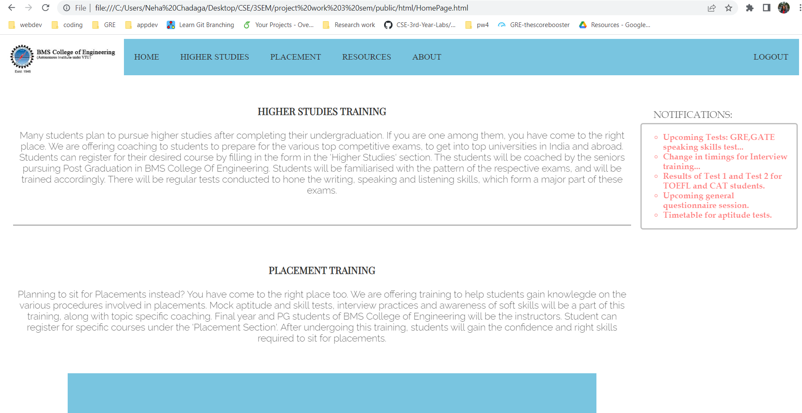

# **Placement-Higher-Studies-Guidance**

A front end application where students can register for either placement training or higher studies training, and access necessary resources. It is developed using HTML5, CSS and Javascript.

## Screenshots
<hr/>
<p align="center">
 <br>  <br> 
</p>

### Clone this repository

```bash
$ git clone https://github.com/neha-chadaga/Placement-Higher-Studies-Guidance.git
```
